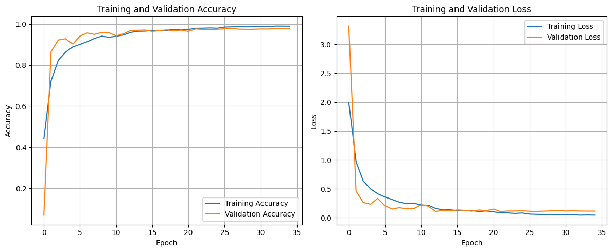
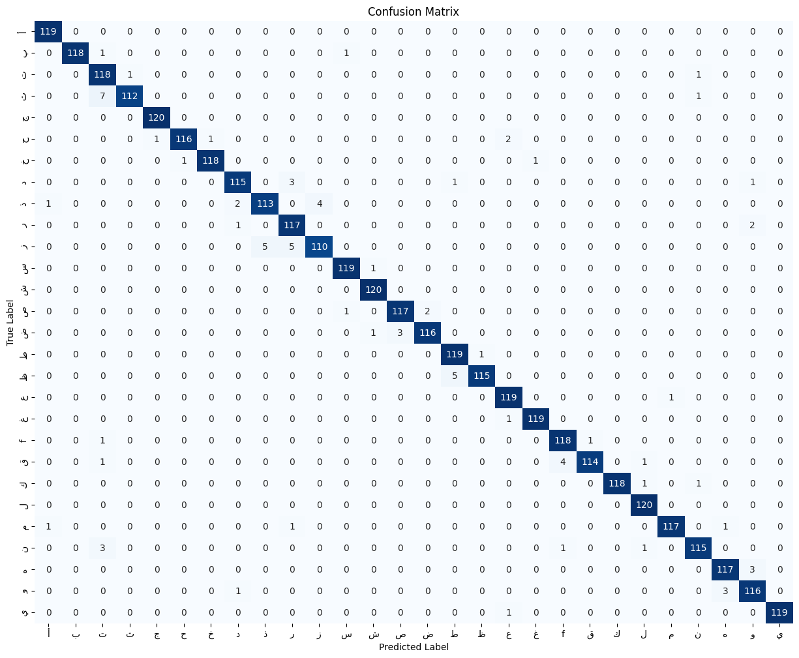
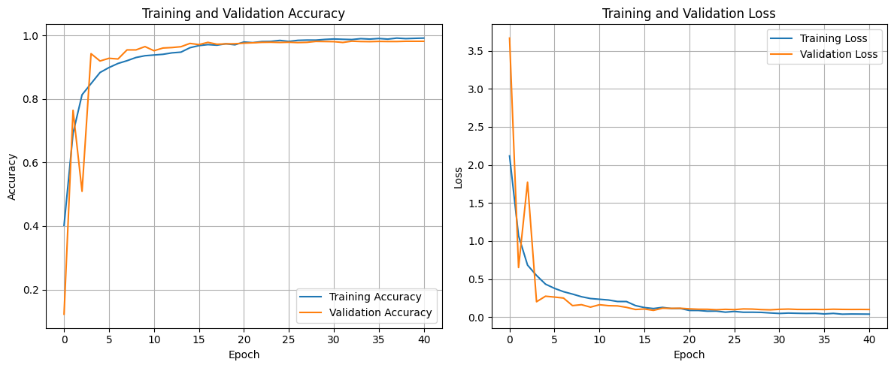
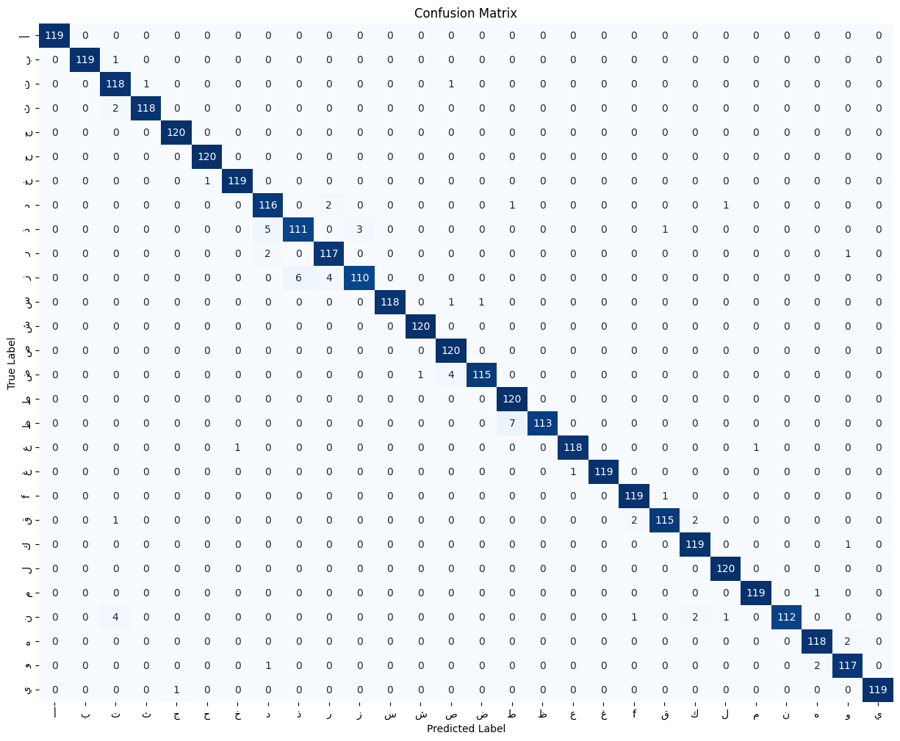
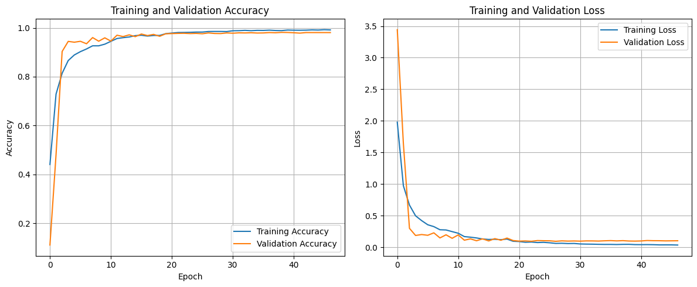
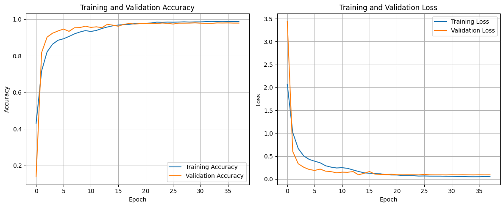
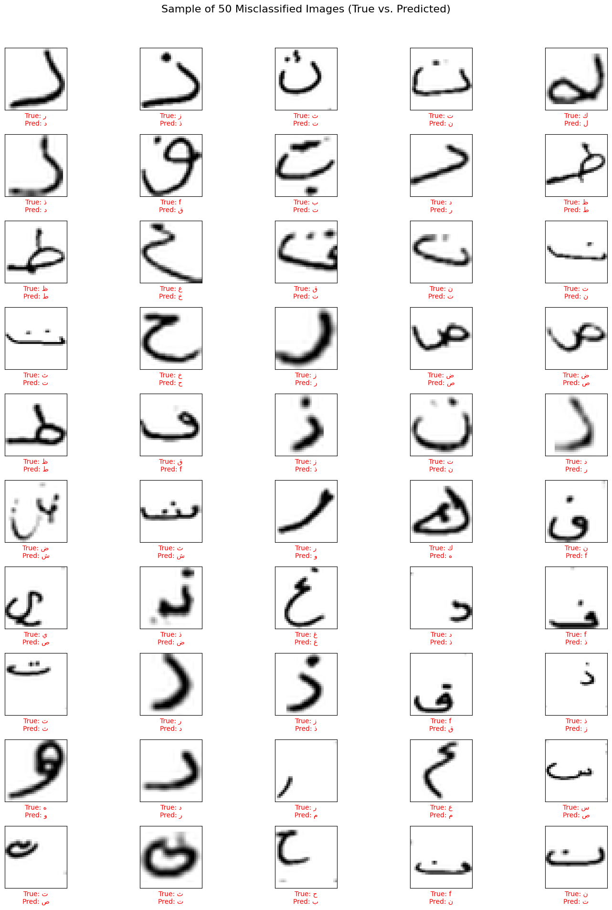

# Arabic Handwritten Character Recognition using Deep CNN

## 1. Project Overview
The primary objective of this project is to develop a robust Deep Learning model capable of classifying handwritten Arabic characters. Unlike Latin scripts, Arabic script presents unique challenges for Optical Character Recognition (OCR) due to its cursive nature, the similarity between character shapes, and the reliance on diacritical dots to distinguish letters. As for this project, only alonestanding letter are considered.

This project implements a **Convolutional Neural Network (CNN)** optimized for the Arabic Handwritten Character Dataset (AHCD). A significant portion of the workflow is dedicated to advanced image preprocessing to normalize handwriting variations, remove noise, and preserve geometric properties, thereby maximizing classification accuracy.

## 2. Dataset and Related Work
The model is trained and evaluated on the **Arabic Handwritten Character Dataset (AHCD)**, often referred to as "Arabic MNIST".

* **Source Format:** CSV files containing flattened pixel values (0-255).
* **Image Dimensions:** 32 x 32 pixels (Grayscale).
* **Classes:** 28 classes representing the Arabic alphabet (from 'Alif' to 'Ya').
* **Data Split:**
    * **Training Set:** 13,440 images.
    * **Test Set:** 3,360 images.

The raw data is provided as vectors (length 1024) and is reshaped into `(32, 32, 1)` matrices during the preprocessing stage.

## 3. Methodology & Procedure

The project workflow is divided into three distinct phases: Data Preprocessing, Model Architecture, and Training Strategy.

### 3.1 Data Preprocessing Pipeline
To prepare the raw CSV data for the CNN, a comprehensive preprocessing pipeline was implemented:

1.  **Reshaping & Normalization:**
    * Conversion of CSV rows into 3D image arrays `(32, 32, 1)`.
    * Pixel intensity normalization to the range `[0, 1]`.

2.  **Geometric Correction:**
    * The raw dataset images are initially misaligned.
    * **Action:** Images are rotated 90 degrees clockwise and flipped vertically (`np.flipud`) to ensure the characters are upright and correctly oriented.

3.  **Noise Removal (Morphological Processing):**
    * Utilizing `skimage.measure.label` and `regionprops`.
    * **Action:** The algorithm identifies connected components within the image. Small, isolated clusters of pixels (noise/ink blots) are removed, retaining only the largest connected component (the character).
    * This didn't work perfectly as the algorithm sometimes skips noise/artifacts. But the noise/artifacts were reduced.

4.  **Aspect-Ratio Preserving Resize:**
    * Standard resizing distorts character shapes.
    * **Action:** Characters are cropped to their bounding box (removing excess whitespace). They are then resized to fit within a 32x32 frame while maintaining their original aspect ratio. The resized character is centered on a black canvas with appropriate padding.

### 3.2 CNN Architecture
A deep Convolutional Neural Network was designed to capture hierarchical features while preventing overfitting:

* **Input Layer:** `(32, 32, 1)`
* **Convolutional Blocks:**
    * Block 1: Conv2D (32 filters) + MaxPool + BatchNorm
    * Block 2: Conv2D (64 filters) + MaxPool + BatchNorm
    * Block 3: Conv2D (128 filters) + AveragePool + BatchNorm
    * Block 4: Conv2D (256 filters) + AveragePool + BatchNorm
* **Classification Head:**
    * Flattening
    * Dense Layers (256, 128, 64, 32 units), each followed by `Dropout(0.2)` and `BatchNormalization`.
* **Output Layer:** Dense (28 units) with `Softmax` activation.

### 3.3 Training Configuration
* **Cross-Validation:** 5-Fold Cross-Validation was employed to ensure model generalizability.
* **Data Augmentation:** `ImageDataGenerator` was used to introduce slight variations (rotation ±10°). *Note: Horizontal flips were disabled as Arabic characters are direction-sensitive.*
* **Callbacks:**
    * `ModelCheckpoint`: Saves the best-performing weights per fold.
    * `ReduceLROnPlateau`: Dynamically adjusts the learning rate when validation loss stagnates.
    * `EarlyStopping`: Terminates training early if no improvement is observed.

## 4. Results and Evaluation

In this project, four variations of the CNN architecture were trained to investigate the impact of different **Pooling Strategies** (Max vs. Average Pooling) and learning rates on classification performance.

The evaluation focuses on how these layers handle the specific characteristics of Arabic handwriting, such as diacritical dots and stroke thickness.
### Model 1: Full Max Pooling (Basline Architecture with Preprocessing)
* **Architecture:**
    * Layers 1-4: `MaxPooling2D`
* **Performance Metrics:**
    * **Average Validation Accuracy:** 98.01%
    * **Average Validation Loss:** 0.0956
* **Analysis:**
    * **Strengths:** High translation invariance; effectively captures the most prominent features of the image.
    * **Weaknesses:** This model achieved the **lowest accuracy and highest loss** among the four. Repeated Max Pooling is too aggressive for this dataset. By consistently taking only the maximum value in a window, it discards too much "background" and lower-intensity information. In Arabic script, where a single dot can change a letter's meaning, losing these smaller spatial details leads to higher misclassification rates.

*Fig. 1: Training history for Model 1. Note the slightly higher validation loss compared to hybrid models.*

*Fig. 2: Confusion Matrix for Model 1.*

---

### Model 2: Full Average Pooling
* **Architecture:**
    * Layers 1-4: `AveragePooling2D`
* **Performance Metrics:**
    * **Average Validation Accuracy:** 98.17%
    * **Average Validation Loss:** 0.0875
* **Analysis:**
    * **Strengths:** Better performance than Full Max Pooling. `AveragePooling` considers all pixels in a pooling window, preserving the overall "ink density" and shape structure. This helps in retaining the context of the character strokes.
    * **Weaknesses:** Solely using Average Pooling can blur sharp edges and reduce contrast, potentially making it harder to distinguish between characters with very similar shapes but distinct sharp features.

*Fig. 3: Training history for Model 2.*

*Fig. 4: Confusion Matrix for Model 2.*

---

### Model 3: Hybrid Pooling (Max First, then Average)
* **Architecture:**
    * Layer 1: `MaxPooling2D`
    * Layers 2-4: `AveragePooling2D`
* **Performance Metrics:**
    * **Average Validation Accuracy:** 98.27%
    * **Average Validation Loss:** 0.0872
* **Analysis:**
    * **Strengths:** This model employs a balanced strategy. The initial `MaxPooling` layer is excellent for extracting sharp, dominant features (like the edges of a character). The subsequent `AveragePooling` layers downsample the feature maps by averaging pixel intensities. This prevents the aggressive information loss associated with repeated Max Pooling, ensuring that subtle features (like faint dots or thin connectors) are retained and smoothed rather than discarded.
    * **Weaknesses:** Slightly higher loss compared to the optimized version (Model 4), indicating potential for further hyperparameter tuning.

*Fig. 5: Training and Validation Accuracy/Loss curves for Model 3, showing stable convergence.*

*Fig. 6: Confusion Matrix for Model 3. Misclassifications are minimal and concentrated around structurally similar characters.*

---

### Model 4: Hybrid Pooling (Max First and Second, then Average)
* **Architecture:**
    * Layer 1-2: `MaxPooling2D`
    * Layers 3-4: `AveragePooling2D`
* **Performance Metrics:**
    * **Average Validation Accuracy:** 98.19%
    * **Average Validation Loss:** 0.0874
* **Analysis:**
    * **Strengths:** This model utilizes the same superior architecture as Model 1 (Hybrid Max/Avg) but has also the second layer as MaxPooling2D. The assumption was to have a clearer and more high valued input for the remaining AvgPooling2D-Layers in order to boost the accuracy even higher.
    * **Conclusion:** The strategy didn't work out as the accuracy was lower and the loss was higher.

*Fig. 7: Training history for the Best Model (Model 4), showing the same loss reduction.*

*Fig. 8: Confusion Matrix for Model 4, displaying the diagonal density.*

### 4.3 Error Analysis (Misclassified Images)
Despite high overall accuracy, misclassifications occur primarily among characters that share similar structural bodies and differ only by diacritical dots.

**Common Misclassification Patterns:**
* **Sad (ص) vs. Dad (ض):** Often confused if the dot is faint or poorly written.
* **Dal (د) vs. Ra (r):** Confused due to similar curvature in handwriting.
* **Ba (ب), Ta (ت), Tha (ث):** Distinguished only by the number and placement of dots.

*Fig. 9: Misclassified Examples.*
---

## 5. Usage
To train the model, ensure the CSV data files are located in the correct directory and run the Jupyter Notebook `Better_CNN_ArabicMNIST.ipynb`. For usage without Google Drive Mount adjust the Import-Codeblock accordingly.

### Dependencies
* Python 3
* TensorFlow / Keras
* NumPy, Pandas
* Matplotlib, Seaborn
* Scikit-Learn, Scikit-Image

### Specs
* Google T4 GPU

### Author
* Muhammed Korkot
* LinkedIn: https://www.linkedin.com/in/muhammed-korkot/

